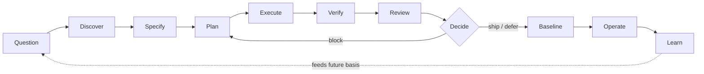

# Nuclear Grade Context Engineering

[](https://github.com/FlyFission/nuclear-grade-context-engineering/actions/workflows/ci.yml)

> A careful, evidence-first way to run AI on software work that matters.

AI agents no longer just suggest code. They edit files, change prompts, call tools, swap dependencies, write the evidence, and help ship releases. That is a lot of power with very little ceremony.

Nuclear-grade gives that work a clear path. Before an agent builds, you ask hard questions. You find the facts. You write down what the change must do. The agent works only inside the limits you set. Then you check the claims against real evidence, decide on purpose, save the approved version, and learn from what happens next.

The discipline is borrowed from how high-consequence engineering is run: question your assumptions, prove your claims, and never let standards slip one small step at a time. The name is the standard, not the vocabulary.

## The one idea

Go fast while you are exploring. Slow down the moment the work becomes a promise.

An agent can try ideas and throw them away cheaply, so let it. But the rules tighten as soon as the work turns into a claim, a file you have to keep under control, a public statement, an approved version, a release call, or a change to what the agent is allowed to do.

The very first question is the most important one: **what does this evidence have to prove, and what fact would change my decision?**

```text
Normal AI coding:
prompt -> diff -> persuasion -> merge risk

Nuclear-grade:
question -> specify -> execute -> verify -> decide -> save approved version -> operate
```

This first release (v0) is a working toolkit you can use today: skills an agent can follow, command prompts you can paste, templates for small and large changes, a small command-line tool, a checker, a public list of sources, one fully worked example, and one hands-on comparison study.

## Try it in 60 seconds

```bash
python tools/ng.py doctor .
python tools/ng.py list
python tools/ng.py new demo-change --mode quick
python tools/ng.py validate .nuclear/changes/demo-change
```

The fourth command is *supposed* to print `FAILED: ...` with `still contains the placeholder marker`. That is the safety check doing its job. Every template ships with a `NUCLEAR-GRADE-PLACEHOLDER` line, and the checker refuses to pass until you delete it. So fill in the parts that matter, delete the marker line, and run `validate` again:

```bash
# In .nuclear/changes/demo-change/risk.md and proof.md, replace the prompts with
# real content, then delete the line that starts with "<!-- NUCLEAR-GRADE-PLACEHOLDER".
python tools/ng.py validate .nuclear/changes/demo-change
# OK: .nuclear/changes/demo-change
```

Look at the included real example:

```bash
python -m pytest docs/03-worked-examples/ai-agent-tool-permissions/tests/test_workspace_guard.py -q
python tools/ng.py validate docs/03-worked-examples/ai-agent-tool-permissions/.nuclear/changes/add-agent-tool-permissions
```

If your shell only has `python3`, use `python3`.

## What you get

| Part | What it does | Start here |
|---|---|---|
| Workflows | Step-by-step paths for small changes, big changes, and the careful checks in between | [`WORKFLOWS.md`](WORKFLOWS.md) |
| Skills | Instructions an agent can follow, each with inputs, outputs, how to verify, when to stop, and warning signs | [`SKILLS.md`](SKILLS.md) |
| Command prompts | Ready-to-paste prompt cards for questioning, sorting risk, checking impact, saving an approved version, reviewing evidence, release checks, and more | [`COMMANDS.md`](COMMANDS.md) |
| Templates | Fill-in records for small changes, standard changes, and high-consequence ones | [`templates/`](templates/) |
| Command-line tool | `init`, `new`, `validate`, `doctor`, `list`, `status`, `migrate` | [`docs/05-reference/cli-reference.md`](docs/05-reference/cli-reference.md) |
| Checker | A no-dependencies check for small and standard change records | [`tools/ng_validate.py`](tools/ng_validate.py) |
| Worked example | A real change record proving an AI agent stayed inside its workspace | [`EXAMPLES.md`](EXAMPLES.md) |
| Sources | The public ideas this borrows from, and how to talk about them safely | [`docs/00-standards-foundation/source-map.md`](docs/00-standards-foundation/source-map.md) |

## How it is different

| The common way | The nuclear-grade way |
|---|---|
| Ask an agent, look at the diff, run the tests. | Question the assumptions, name what must stay under control, write down the intent, check the evidence, decide, and save the approved version. |
| The pull request text tries to talk reviewers into a yes. | A change record links intent, what must not break, what is under control, the evidence, the gaps, and the decision. |
| Agents get broad access and vague instructions. | Agents get a role, a list of what they may do, what they may not do, what they must prove, where the work stands, and when to stop. |
| Green tests become the reason to ship. | The release record states the evidence, the leftover risk, the rollback plan, what to watch, the decision, and what to save. |
| Lessons disappear into the chat history. | Lessons from real operation feed back into future plans, tests, monitors, and controls. |

The shift, in one view:

```text
review the diff           -> review the whole approved setup
trust the prompt history  -> keep a controlled record of the change
hand the agent free rein  -> hand it focused context and a duty to prove
treat green tests as a yes -> make an explicit release decision and save the result
```

This is practical, not decorative. Instructions should be hard to misuse. Small actions should still serve the goal. And "I'm confident" should never be confused with "here is the proof."

## The full path

```text
Question -> Discover -> Specify -> Plan -> Execute -> Verify -> Review -> Decide -> Baseline -> Operate -> Learn
```

Each step is a control point: it stops one specific failure mode and produces one artifact you can point at. A skipped step is not a shortcut — it is a named failure mode you chose to accept. The control-point detail — stops / produces / abort-if — is tabled for the everyday seven-step form of this loop in [`WORKFLOWS.md`](WORKFLOWS.md), and the same control points apply when the loop fans out into all eleven beats.



More diagrams (mode decision tree, skill graph, packet artifact graph) are in [`docs/diagrams.md`](docs/diagrams.md).

A "baseline" is just the version you have agreed is correct and want to protect. Small and standard change records are the Git-native way to walk a change through this path. You sort the risk early so the simple path stays easy to teach. You only add the heavier records — what is under control, ripple effects, the saved baseline, drift, and operating lessons — when the stakes are high enough to earn them.

Underneath the path sit a few habits borrowed from high-reliability work, what we call HPI for AI agents (Human Performance Improvement). Use them when they change the outcome: brief the work before a risky step, double-check critical actions, hand off cleanly, get a second set of eyes when trust is on the line, and capture the lesson after a near miss.

## Leadership and high reliability: top-down and bottom-up

The submarine world it borrows from is not only about procedure. It is about how authority moves. Nuclear-grade applies that in two directions at once.

- **Top-down:** supervisors supply *clarity* (the mission, the constraints, what good looks like) and grow *competence* (evidence, evals, a track record) so that authority can move to where the information already is. The leader's job shifts from approving every move to verifying clarity and competence.
- **Bottom-up:** the person or agent closest to the work *declares intent and reasoning* before a critical action — "I intend to do X because the checks show Y" — surfaces what they see, and *escalates at trust boundaries*. Anyone may halt unclear work, and bad news is protected, never punished.

The point is to push authority to the information, not to remove a human gate. The gradient raises rigor where it matters: reversible, well-evidenced work is decided at the edge; anything irreversible, trust-bearing, or thinly evidenced escalates. And because AI amplifies an organization's existing strengths and weaknesses, this discipline matters more with agents, not less — treat AI output as a hypothesis to prove, not as authority. See [`docs/01-field-guide/leadership-and-high-reliability.md`](docs/01-field-guide/leadership-and-high-reliability.md).

## Change records: small vs. standard

This first release checks two kinds of change records.

```text
.nuclear/changes/<name>/
```

| Kind | Use it when | Files |
|---|---|---|
| Quick | Low stakes, easy to undo, obvious proof, no new trust boundary | `risk.md`, `proof.md` |
| Standard | It touches users, dependencies, permissions, data, AI behavior, operations, or a release | `risk.md`, `basis.md`, `plan.md`, `trace.md`, `verification.md`, `ship.md` |

The heavier patterns (high-consequence, incident, research-board, and release) are written down here, but for now treat them as human-reviewed until your own project has tested them.

## Who this is for

Use Nuclear-grade if you are:

- building AI agents that write files, call APIs, use credentials, approve actions, or affect releases;
- using coding agents on work that matters more than a throwaway script;
- reviewing AI-assisted pull requests and want evidence instead of a sales pitch;
- leading a team that wants speed without losing the plot on risk and releases;
- building internal workflows where people and agents both need focused context and a duty to prove their claims.

## What this is not

Nuclear-grade is not a compliance program, a certification, a regulated quality-assurance system, a safety analysis, a production sandbox, a regulatory submission, legal advice, or a substitute for qualified engineering, legal, security, safety, or compliance review.

It does not claim that any system is safe, secure, compliant, approved, certified, or fit for regulated use.

Read these before you use it:

- [`DISCLAIMER.md`](DISCLAIMER.md)
- [`docs/00-standards-foundation/compliance-boundaries.md`](docs/00-standards-foundation/compliance-boundaries.md)
- [`docs/00-standards-foundation/do-not-cite-directly.md`](docs/00-standards-foundation/do-not-cite-directly.md)

## Map of the repo

```text
skills/                         skills an agent can follow
commands/                       paste-ready command prompts
templates/                      fill-in records for small, standard, and high-consequence changes
tools/                          the command-line tool and the checker
tests/                          tests for the checker, the tool, the contracts, and the public docs
docs/00-standards-foundation/   sources, safe citation, compliance boundaries
docs/01-field-guide/            how each source idea maps to a plain concept, incl. the leadership and high-reliability guide
docs/02-operating-system/       the path, the habits, the modes, the records, the checks, authority and intent, incidents, deficiencies
docs/03-worked-examples/        the flagship worked example
docs/04-adoption/               rollout, agent permissions, reviewer playbook
docs/05-reference/              the skill, command, and tool contracts
docs/diagrams.md                visual maps of the path, modes, skills, and records
docs/glossary.md                plain-language decoding of terms and idioms
```

## What is in v0

Included now:

- a get-started-fast onboarding and a map of the repo;
- templates for small and standard changes;
- heavier templates for what is under control, ripple effects, saved baselines, drift, and operating lessons;
- "golden path" templates for questioning, writing a spec, handing off, self-checking, and recording a decision;
- a local command-line tool and a no-dependencies checker;
- skills an agent can follow and command prompts you can paste;
- a public list of sources and honest labels for how settled each one is;
- a worked example proving an AI agent only wrote inside its workspace (checked by tests);
- a hands-on comparison across twelve real use cases (see `docs/03-worked-examples/skill-workflow-comparison/`);
- tests for the checker, the tool, the skill and command contracts, the public docs, and the example code.

Not included yet:

- a packaged plug-in for one specific agent platform;
- full worked examples for external API controls and human approval steps;
- deep automated checking for the heavier change patterns;
- a production sandbox, a compliance package, or any regulated-use assurance workflow.

## License and limits

Nuclear-grade is released under the [`MIT License`](LICENSE). You may use, copy, change, publish, distribute, sublicense, and sell copies under the license terms.

That permission is not a promise about quality. Using this repo does not create formal verification and validation, NQA-1 evidence, NQA-1 record, compliance, certification, regulatory approval, or any safety, security, procurement, production, warranty, or support guarantee.

The public sources named here are influences and idea lineage. They are not standards this repo claims to meet.

## Where the ideas come from

Nuclear-grade is an original software workflow inspired by public sources. The source families are mapped in [`docs/00-standards-foundation/source-map.md`](docs/00-standards-foundation/source-map.md) and translated into plain concepts in [`docs/01-field-guide/source-to-concept-crosswalk.md`](docs/01-field-guide/source-to-concept-crosswalk.md).
