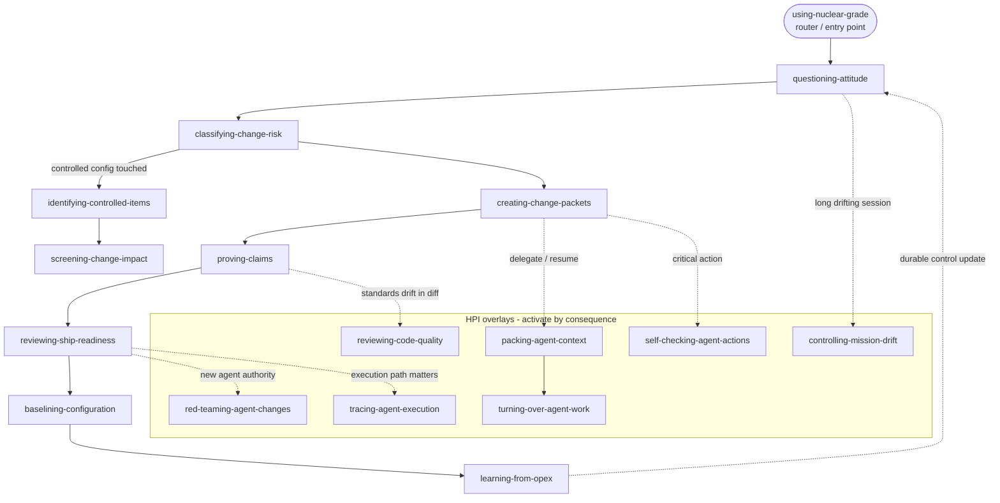

# Nuclear-grade Skills

Skills are self-contained agent instructions. Each skill has a `SKILL.md` contract with triggers, inputs, process, outputs, verification, escalation, red flags, and source-lineage boundaries.

## Catalog

| Skill | Use when | Output |
|---|---|---|
| [`questioning-attitude`](skills/questioning-attitude/SKILL.md) | Challenging assumptions before work, review, or release continues | Assumptions, evidence gaps, stop conditions |
| [`using-nuclear-grade`](skills/using-nuclear-grade/SKILL.md) | Adopting the workflow for a change or repo | Mode, packet path, evidence path |
| [`identifying-controlled-items`](skills/identifying-controlled-items/SKILL.md) | Deciding what configuration must be controlled | Controlled item list |
| [`screening-change-impact`](skills/screening-change-impact/SKILL.md) | Checking downstream impact and revalidation triggers | Impact screen |
| [`baselining-configuration`](skills/baselining-configuration/SKILL.md) | Recording accepted controlled configuration state | Baseline record |
| [`classifying-change-risk`](skills/classifying-change-risk/SKILL.md) | Selecting Quick, Standard, or stronger human-reviewed mode | Mode decision and evidence obligation |
| [`creating-change-packets`](skills/creating-change-packets/SKILL.md) | Creating or updating packet files | Quick or Standard packet |
| [`packing-agent-context`](skills/packing-agent-context/SKILL.md) | Preparing focused agent or reviewer context | Context pack |
| [`turning-over-agent-work`](skills/turning-over-agent-work/SKILL.md) | Handing off unfinished agent, review, verification, release, or resumed-thread work | Turnover record |
| [`self-checking-agent-actions`](skills/self-checking-agent-actions/SKILL.md) | Checking critical agent edits, commands, public claims, trust changes, or releases before action | Self-check record |
| [`proving-claims`](skills/proving-claims/SKILL.md) | Mapping claims to evidence and gaps | Claim-to-evidence rows |
| [`reviewing-ship-readiness`](skills/reviewing-ship-readiness/SKILL.md) | Deciding ship, block, defer, or ship-with-risk | Release decision record |
| [`learning-from-opex`](skills/learning-from-opex/SKILL.md) | Turning near misses, bad handoffs, review surprises, or operating signals into durable updates | OPEX action |
| [`checking-dependency-and-model-trust`](skills/checking-dependency-and-model-trust/SKILL.md) | Reviewing dependency, model, API, SaaS, generated artifact, or vendor trust | Intended-use trust screen |
| [`checking-source-lineage`](skills/checking-source-lineage/SKILL.md) | Reviewing citation and source-family claims | Source-safe wording |
| [`checking-license-and-assurance-boundaries`](skills/checking-license-and-assurance-boundaries/SKILL.md) | Reviewing license and assurance language | Boundary-safe wording |
| [`controlling-mission-drift`](skills/controlling-mission-drift/SKILL.md) | Work drifts from the objective, scope creeps, or rigor erodes one concession at a time | Re-anchor / escalate / stop decision and updated mission anchor |
| [`reviewing-code-quality`](skills/reviewing-code-quality/SKILL.md) | Reviewing a diff or module for standards drift and needless complexity | Prioritized findings and a single verdict |
| [`red-teaming-agent-changes`](skills/red-teaming-agent-changes/SKILL.md) | Adversarially probing agent tool grants, dependencies, models, or releases for injection, escalation, unsafe output, or tool misuse | Red-team findings record |
| [`tracing-agent-execution`](skills/tracing-agent-execution/SKILL.md) | Capturing agent tool calls, decisions, inputs, outputs, token use, and approval gates as structured execution evidence | Execution trace record |
| [`decomposing-work-breakdown`](skills/decomposing-work-breakdown/SKILL.md) | Decomposing an epic, feature, or subsystem into a product-oriented, 100%-rule, non-overlapping work breakdown | WBS table and dictionary |
| [`structuring-agentic-folders`](skills/structuring-agentic-folders/SKILL.md) | Laying out a repo or agent workspace, placing a file, or fixing a junk-drawer directory | Folder map and naming/depth audit |

## How the skills compose

`using-nuclear-grade` is the entry point and router. From there the spine runs question -> classify -> create -> prove -> ship -> baseline -> learn, and the HPI overlays activate only when consequence warrants them. Reach for an overlay when its trigger fires, not by default.

See [`docs/diagrams.md`](docs/diagrams.md) for the lifecycle, mode, and packet diagrams.

## Contract

Every skill must include:

- YAML frontmatter with `name` and `description` (required); `license` and `compatibility` are optional.
- A `name` that is lowercase and hyphen-separated.
- A `description` that says what the skill does, when to trigger it, and a "Do not use for ..." negative clause (80 to 500 characters, no colon-space).
- Overview, use and non-use conditions, inputs, process, outputs, verification, escalation, common rationalizations, red flags, and source-lineage note.

Skills may add optional `references/`, `scripts/`, and `assets/` subfolders for progressive disclosure. See `docs/05-reference/skill-authoring-contract.md`.

## Boundary note

Skills help agents preserve evidence and boundaries. They do not create formal V&V, compliance, certification, safety, security, or regulatory adequacy.
