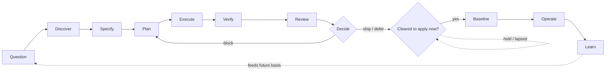
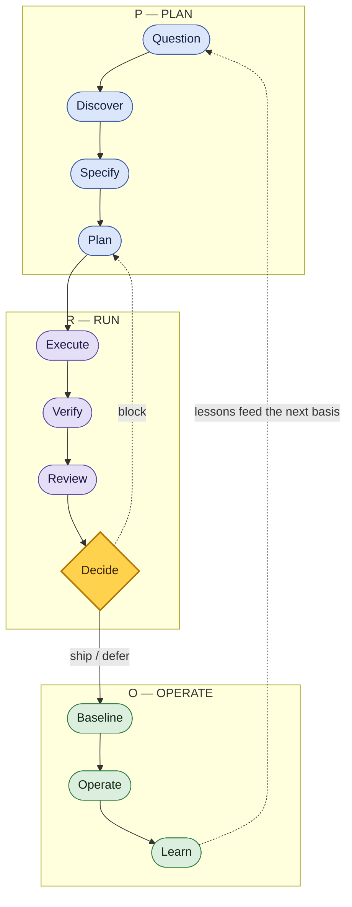
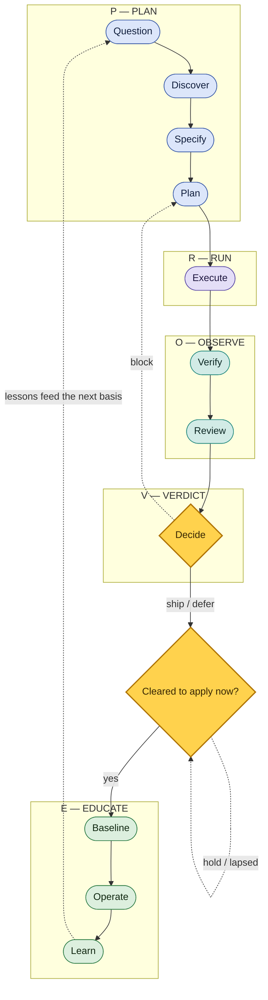
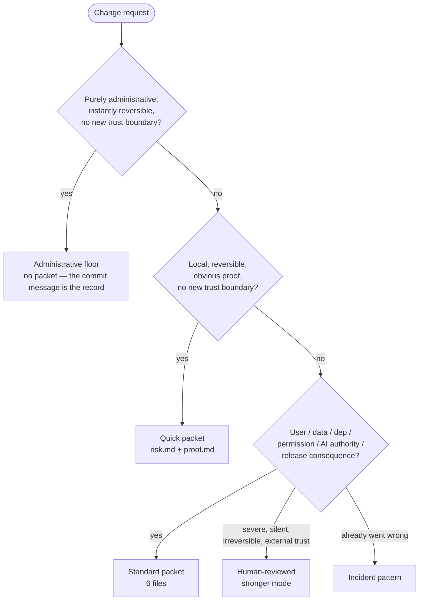
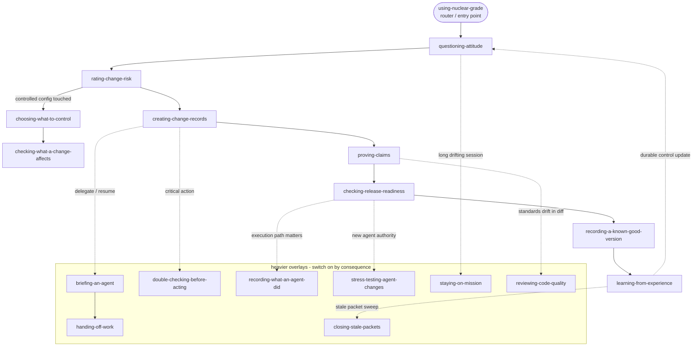
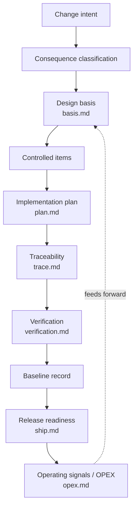
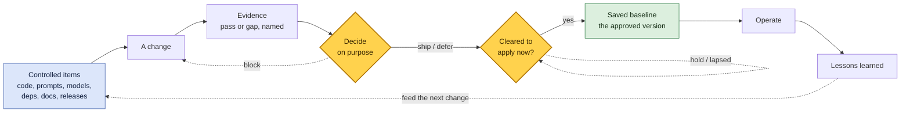
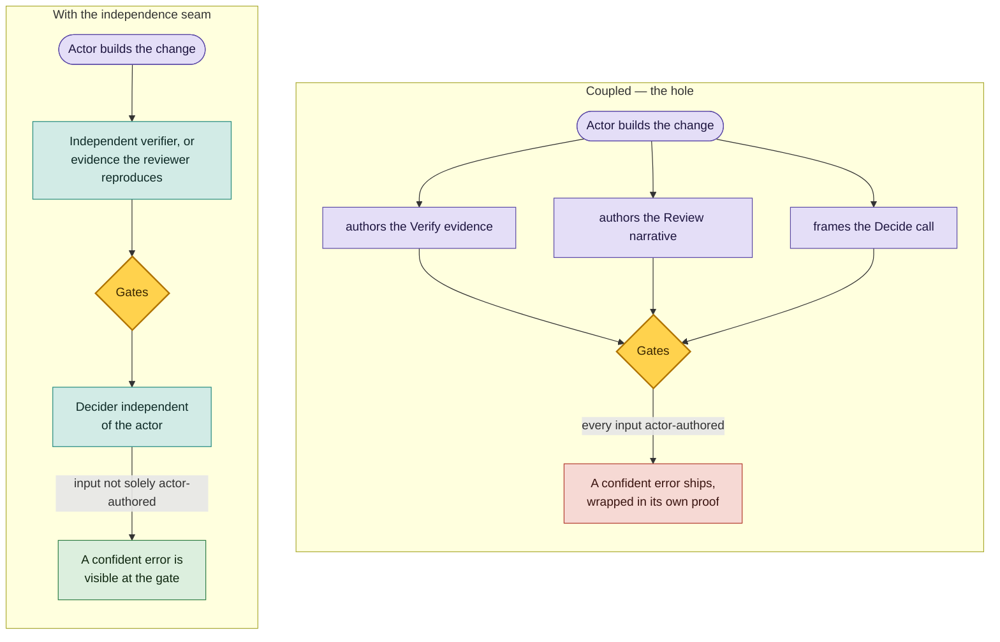

# Nuclear-grade Diagrams

Visual maps of the workflow. These are the canonical source for the diagrams embedded across the public docs; update them here and mirror changes where they are referenced.

Diagrams are Mermaid so they render natively on GitHub, stay diffable in version control, and need no build step. Treat each diagram as a controlled item: when the lifecycle, modes, or skill set change, update the matching diagram in the same change.

---

## 1. Core lifecycle

The full lifecycle. The short, at-a-glance version is `question -> specify -> execute -> verify -> decide -> baseline -> operate -> learn` (the eight everyday control points); the full path below splits three of them to reach the eleven beats.



The **Decide** gate is the *verdict* — is the change correct and worth releasing? **Cleared to apply now?** is a separate, operator-owned gate: even a `ship` verdict waits if a freeze window is closed, an approval lapsed, external state drifted, or policy changed. It is re-checked at apply-time, so a stale "go" cannot ship a correct change into the wrong moment. See [`02-operating-system/lifecycle.md`](02-operating-system/lifecycle.md).

---

## 2. The PROVE path — one path, two zoom levels

The same eleven beats, grouped into a handle you can remember. Zoom out to **PRO** — three moves. Zoom in to **PROVE** — five, with the acceptance gate named on its own. The beats, their order, and the control points are unchanged; this is a label, not a new workflow.

**PRO — the billboard (3):**



**PROVE — the working map (5):**



**Crosswalk — how the zoom levels line up:**

| Full path (11 beats) | PROVE — working map (5) | PRO — billboard (3) |
|---|---|---|
| Question · Discover · Specify · Plan | **P** — Plan | **P** — Plan |
| Execute | **R** — Run | **R** — Run |
| Verify · Review | **O** — Observe | ↳ inside Run |
| Decide | **V** — Verdict | ↳ inside Run |
| Baseline · Operate · Learn | **E** — Educate | **O** — Operate |

PROVE and PRO are memory handles for the same eleven-beat path; the [eight control points](../WORKFLOWS.md) are the everyday short form of those eleven beats, and the [Core 7](../CORE.md) are always-on habits, not path stages. One letter is reused across the two zoom levels — **O** is *Observe* (Verify · Review) in PROVE but *Operate* (run it in the world) in PRO — so when they differ, read the crosswalk above, not the letter. "PROVE" names the prove-your-claims habit — evidence behind every claim — not formal proof or verification.

---

## 3. Mode decision tree

Which packet mode a change earns. Rigor scales with consequence, not effort tolerance.



---

## 4. Skill-relationship graph

How the skills compose. `using-nuclear-grade` is the single way in and the router; the main path is the per-change pipeline; the heavier overlays switch on only when the stakes call for them.



---

## 5. Packet artifact-dependency graph

How a Standard packet's records depend on each other. Later records point back to the basis they depend on; operating lessons feed forward into the next change. The text form lives in [`00-standards-foundation/artifact-dependency-graph.md`](00-standards-foundation/artifact-dependency-graph.md).



---

## 6. Who does what in one change

**Four roles and one controlled artifact** hand off authority over a single change: the **human owner**, **builder**, **change record**, and **verifier**, plus the **exact candidate** being judged. These are roles and an artifact, not model brands. The human approves criteria and limits, authorizes build and correction, and retains merge/apply authority. The verifier checks the exact candidate; whether that check counts as independent depends on disclosed evidence custody and separation, not the label. Criteria challenge is a function assigned before build according to consequence, not necessarily a fifth standing role. Read top to bottom.

```mermaid
sequenceDiagram
    actor You as Human owner
    participant Agent as Builder
    participant Candidate as Exact candidate
    participant Record as Change record
    actor Verifier as Verifier / checker
    You->>Record: Classify risk; approve criteria and limits
    You->>Agent: Authorize bounded build
    Agent->>Candidate: Build inside approved limits
    Agent->>Record: Link claims, evidence, candidate ID
    Record-->>Verifier: Present criteria, evidence, gaps, candidate ID
    Verifier->>Candidate: Reproduce decisive checks
    Verifier->>Record: Verdict bound to candidate ID
    Candidate-->>You: Expose current candidate ID
    You->>Record: Confirm identity match or hold
    Record-->>You: Present verdict, gaps, residual risk
    You->>Record: Merge/apply, hold, or authorize correction
    Record->>Record: On acceptance, save baseline
    Note over Agent,Verifier: Material correction: new ID; prior verdict is stale; re-verify
    Note over You,Verifier: Budget exhausted: stop and escalate to human owner
```

**In words (text fallback):** the human classifies the risk and approves the criteria and limits → the human authorizes the builder to change one exact candidate → the record binds claims and evidence to that candidate → the verifier reproduces the decisive checks and records a verdict against the candidate ID → the human confirms that the current candidate still matches the reviewed identity → the human merges/applies, holds, or authorizes a bounded correction → any material correction creates a new identity, makes the old verdict stale, and returns the candidate to verification → an exhausted correction budget stops and escalates rather than lowering the criteria → an accepted version becomes the baseline → lessons from use feed the next change.

---

## 7. Keeping the approved version under control

The configuration-management loop in one picture. A **baseline** is the version everyone agreed is correct and wants to protect. Changes do not edit the baseline directly — they go through evidence and a decision first, and only an accepted change becomes the new baseline.



**In words (text fallback):** controlled items (code, prompts, models, dependencies, docs, releases) → a change → named evidence (pass or gap) → a deliberate decision (the *verdict*: correct and worth releasing?) → if ship/defer, a separate apply-clearance gate (may it be applied *now* — approvals, window, external state, policy?), re-checked at apply-time; if cleared, save the new baseline; if block, back to the change → operate the baseline → lessons learned feed the next change to the controlled items.

---

## 8. Actor-evidence independence

The loop's gates after Execute — Verify, Review, Decide — assume the evidence they read is independent of the actor. In the default single-agent path it is not: the same agent authors the change *and* every input the gates read, so a confident error ships wrapped in its own proof. The seam breaks that coupling in proportion to the stakes. See [`02-operating-system/actor-evidence-independence.md`](02-operating-system/actor-evidence-independence.md).



**In words (text fallback):** in the coupled default, the actor builds the change and also authors the Verify evidence, the Review narrative, and the Decide framing, so the gates only ever see what the actor wrote and a confident hallucination clears them. With the seam, the load-bearing claim's evidence is authored by an independent verifier (or reproduced by the reviewer) and the decider is independent of the actor, so the same error is visible at the gate instead of laundered through it.

---

## Source-lineage note

These diagrams are an original visual restatement of the Nuclear-grade workflow, influenced by public lifecycle, configuration-management, and software-assurance sources mapped in [`00-standards-foundation/source-map.md`](00-standards-foundation/source-map.md). They do not create formal V&V, compliance, certification, safety, security, or regulatory adequacy.
