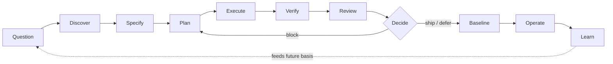
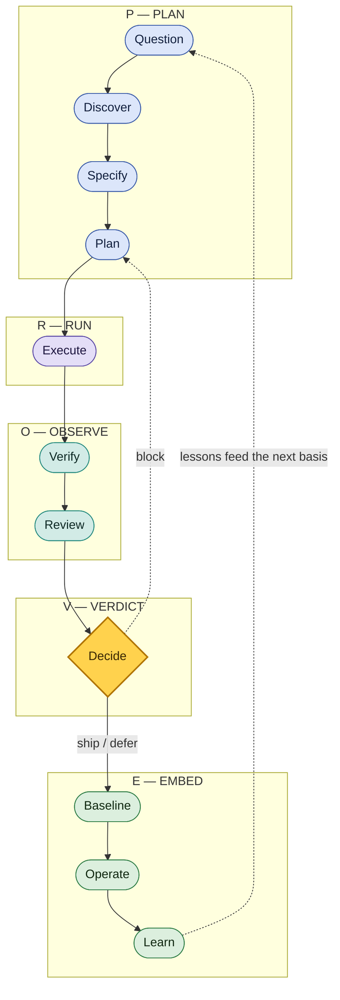
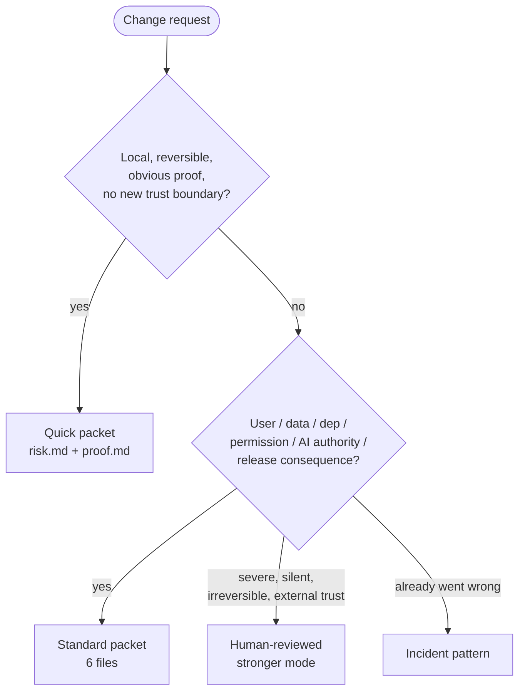
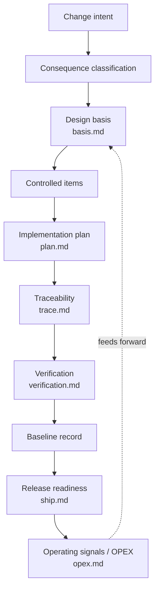

# Nuclear-grade Diagrams

Visual maps of the workflow. These are the canonical source for the diagrams embedded across the public docs; update them here and mirror changes where they are referenced.

Diagrams are Mermaid so they render natively on GitHub, stay diffable in version control, and need no build step. Treat each diagram as a controlled item: when the lifecycle, modes, or skill set change, update the matching diagram in the same change.

---

## 1. Core lifecycle

The full lifecycle. The short launch version is `Question -> Specify -> Execute -> Verify -> Decide`.

---

## 2. The PROVE path — one path, two zoom levels

The same eleven beats, grouped into a handle you can remember. Zoom out to **PRO** — three moves. Zoom in to **PROVE** — five, with the acceptance gate named on its own. The beats, their order, and the control points are unchanged; this is a label, not a new workflow.

**PRO — the billboard (3):**

**PROVE — the working map (5):**

**Crosswalk — how the zoom levels line up:**

| Full path (11 beats) | PROVE — working map (5) | PRO — billboard (3) |
|---|---|---|
| Question · Discover · Specify · Plan | **P** — Plan | **P** — Plan |
| Execute | **R** — Run | **R** — Run |
| Verify · Review | **O** — Observe | ↳ inside Run |
| Decide | **V** — Verdict | ↳ inside Run |
| Baseline · Operate · Learn | **E** — Embed | **O** — Operate |

PROVE and PRO are memory handles for the full eleven-beat path; the [seven control points](../WORKFLOWS.md) are its everyday short form, and the [Core 7](../CORE.md) are always-on habits, not path stages. "PROVE" names the prove-your-claims habit — evidence behind every claim — not formal proof or verification.

---

## 3. Mode decision tree

Which packet mode a change earns. Rigor scales with consequence, not effort tolerance.

---

## 4. Skill-relationship graph

How the skills compose. `using-nuclear-grade` is the single way in and the router; the main path is the per-change pipeline; the heavier overlays switch on only when the stakes call for them.

---

## 5. Packet artifact-dependency graph

How a Standard packet's records depend on each other. Later records point back to the basis they depend on; operating lessons feed forward into the next change. The text form lives in [`00-standards-foundation/artifact-dependency-graph.md`](00-standards-foundation/artifact-dependency-graph.md).

---

## Source-lineage note

These diagrams are an original visual restatement of the Nuclear-grade workflow, influenced by public lifecycle, configuration-management, and software-assurance sources mapped in [`00-standards-foundation/source-map.md`](00-standards-foundation/source-map.md). They do not create formal V&V, compliance, certification, safety, security, or regulatory adequacy.
